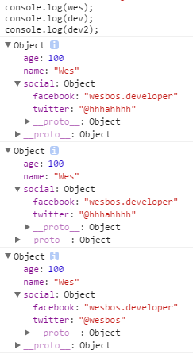

# javascript 中 Object 和 Array 的深浅复制

#### 1.什么是深复制和浅复制

​	顾名思义，深复制和浅复制必然是在现有数据的基础上拷贝了一份一模一样的数据，由于在将对象实例复制给变量时，变量保存是对象实例在内存中的地址，而不是对象实例本身，这个时候复制就有了复制实例和复制引用两种情况，这也是深复制和浅复制的本质区别。深复制复制的是对象实例，而浅复制复制的是对象引用。

​	浅复制代码实例：	

```javascript
const person1 = {name : "Wes",age : 32};
const person2 = person1;
console.log(person1, person2);
//Object {name: "Wes", age: 32} Object {name: "Wes", age: 32}
person2.age = 30;
console.log(person1, person2);
//Object {name: "Wes", age: 30} Object {name: "Wes", age: 30}
```
​	更改 person2 对象的age属性时，person1 对象的age属性也跟着变化，在复制过程中 person2 只复制person1 的引用，person2 和 person1 指向同一对象实例，因此改变 person2 的 age 属性时 person1 的 age 属性也跟着变化。

#### 2.数组实现深复制
```javascript
const players = ['Wes', 'Sarah', 'Ryan', 'Poppy'];

//浅复制
const team1 = players;
console.log(team1);  //["Wes", "Sarah", "Ryan", "Poppy"]

//深复制
//slice() 方法返回一个从开始到结束（不包括结束）选择的数组的一部分浅拷贝到一个新数组对象。原数组不会被修改
const team2 = players.slice();
console.log(team2);  //["Wes", "Sarah", "Ryan", "Poppy"]
// concat() 方法用于合并两个或多个数组。此方法不会更改现有数组，而是返回一个新数组。
const team3 = [].concat(players);
console.log(team3);  //["Wes", "Sarah", "Ryan", "Poppy"]
//Array.from() 方法从一个类似数组或可迭代对象创建一个新的数组实例。
const team4 = Array.from(players);
console.log(team4);  //["Wes", "Sarah", "Ryan", "Poppy"]
//onvert arguments to a real Array
const team5 = [...players];
console.log(team5);  //["Wes", "Sarah", "Ryan", "Poppy"]
//验证所复制的数组与原数组是不是相等
console.log(players === team1);   //true
console.log(players === team2);   //false
console.log(players === team3);   //false
console.log(players === team4);   //false
console.log(players === team5);   //false
```
​	由以上代码可以看到，以上四种方法所进行是深复制均可以返回一个新的数组实例，与原数组之前互不影响。由于是新生成的数组实例，所复制的结果与原数组也不相等。

#### 3.Object的深复制（ JSON 对象的 parse() 和 stringify() ）

```javascript
const wes = {
  name : 'Wes',
  age : 100,
  social : {
    twitter : '@wesbos',
    facebook : 'wesbos.developer'
  }
};
//浅复制
const dev = Object.assign({}, wes);
//深复制
const dev2 = JSON.parse(JSON.stringify(wes));
wes.social.twitter = "@hhhahhhh"
console.log(wes);
console.log(dev);
console.log(dev2);
```



​	先使用JSON对象的 stringify() 方法可以将 javascript 对象序列化为JSON字符串，然后使用JSON对象的 parse() 将JSON字符串反序列成JS对象，这种方式的缺点也显而易见，深复制之后对象都会变成Object。

#### 4.使用第三方库实现深复制

​	① jQuery 的 extend() / clone()

​	② Underscore 的 _.clone()
​	③ lodash 的 _.clone() / _.cloneDeep()

​	

